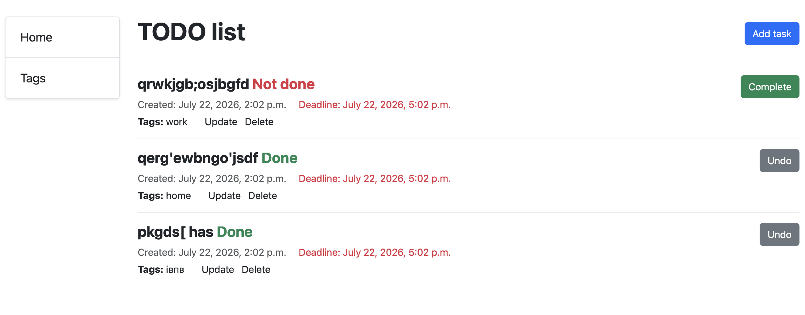
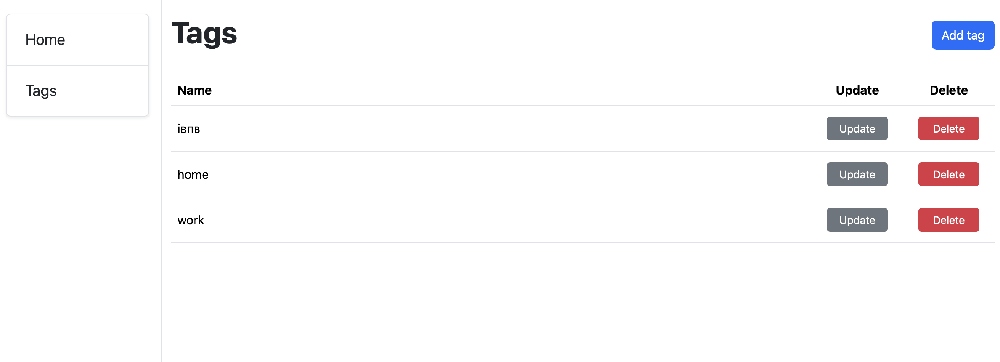

# Todo List

A Django web application for managing daily tasks. Users can create, update, delete and organize tasks using tags and deadlines.

---

## Features

- Create, update and delete tasks
- Mark tasks as completed or not completed
- Organize tasks with tags
- Set deadlines for tasks
- Manage tags (create, update, delete)
- Responsive Bootstrap 5 interface

---

## Technologies

- Python 3
- Django 6
- SQLite
- Bootstrap 5
- Crispy Forms
- Crispy Bootstrap 5

---

## Installation

```bash
git clone <repository-url>
cd <repository-folder>

python -m venv venv

# macOS / Linux
source venv/bin/activate

# Windows
venv\Scripts\activate

pip install -r requirements.txt
```

Create `.env`

```text
SECRET_KEY=your_secret_key
```

Apply migrations

```bash
python manage.py migrate
```

Run server

```bash
python manage.py runserver
```

---

## Screenshots

### Todo List



Users can create tasks, assign tags, set deadlines, and mark tasks as completed.

### Tags



Manage task categories by creating, editing, and deleting tags.

---

## Project Structure

```
tasks_project/
│── tasks/
│── tasks_project/
│── templates/
│── static/
│── images/
│── manage.py
│── requirements.txt
│── README.md
│── .env.example
```

---

## Author

Created as a learning project with Django.